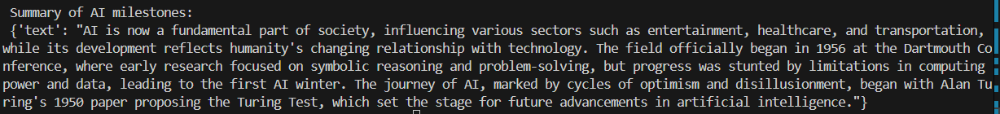

# LangChain Summarization ProjectA 
project to master LangChain through structured tasks. 
Contributor: - Muhammad Umair Shaikh

## Tasks Completed  

### Task 1: Setting Up LangChain Environment  
- Created a Python virtual environment.  
- Installed required packages: `langchain`, `openai`, `python-dotenv`.   

### Task 2: Building a Basic Summarization Chain  
- Configured **Azure OpenAI model** using environment variables.  
- Designed a **prompt template** to summarize text into **exactly 3 sentences**.  
- Built an `LLMChain` that combined the prompt with the model.  
- Tested it with a **200-word paragraph about Artificial Intelligence**.  
- Modified the prompt to summarize into **1 sentence** and compared outputs.  

### Task 3: Exploring Retrievers with Summarization
- Chunks and Embeddings Vectors

- Summary

### Task 4: Creating an Agent for Summarization
- A LangChain Agent powered by a custom tool called TextSummarizer, which wraps the summarization chain from Task 2. The agent was tested with both a clear request and a vague request to demonstrate how it interprets and executes summarization tasks.

🔹 Query 1: Summarize the impact of AI on healthcare

Result:
Artificial intelligence (AI) is revolutionizing healthcare by enhancing diagnosis, treatment, and patient outcomes through advanced machine learning models and imaging systems. These technologies enable earlier and more accurate disease detection, optimize hospital resource management, and offer support via virtual assistants and chatbots. Despite ethical concerns regarding data privacy and bias, the integration of AI in healthcare is expanding, leading to greater efficiency and improved patient care globally.

🔹 Query 2: Summarize something interesting

Result:
The discovery of penicillin by Alexander Fleming in 1928 was a pivotal moment in medical history, revolutionizing the treatment of bacterial infections. This breakthrough led to the development of other antibiotics, significantly impacting healthcare practices. Fleming's contributions have saved countless lives and remain influential in modern medicine.

### Task 5: Combining Chains, Retrievers, and Agents

In this task, we built a multi-tool agent pipeline that integrates:

Retriever Tool – extracts relevant chunks of text from a document (Task 3).

Summarizer Tool – summarizes retrieved text into concise sentences (Task 2).

Word Counter Tool – counts words in the summary output.

This allows the agent to retrieve, summarize, and analyze text in a single workflow.

🔹 Query 1: Find and summarize text about AI breakthroughs from the document

Agent Response:
The 2010s marked significant advancements in AI, particularly with deep learning, as powerful GPUs and large datasets enabled deep neural networks to excel in tasks like image recognition and language modeling. Notable achievements included Google DeepMind's AlphaGo defeating the world champion Go player in 2016 and the emergence of generative models like GPT, which produced human-like text. Today, AI is integral to various aspects of society, influencing everything from recommendation systems to medical diagnostics, while its history reflects a cycle of optimism and renewed discovery in the field.

🔹 Query 2: Find and summarize text about AI breakthroughs, then count words

Summary:
The 2010s marked a significant turning point for AI with the advent of deep learning, leading to remarkable achievements such as AlphaGo's victory over the world champion Go player in 2016 and the emergence of generative models like GPT. Despite earlier setbacks, advancements in computing power and data availability revitalized AI research, with milestones like IBM's Deep Blue defeating Garry Kasparov in 1997 showcasing AI's potential to exceed human capabilities in specific tasks. Today, AI is integral to various aspects of society, influencing everything from recommendation systems to medical diagnostics, while reflecting the ongoing evolution of our relationship with intelligent machines.

Word Count: 101

✅ Outcome: Successfully demonstrated an agent workflow combining retrieval + summarization + word count into a seamless process.

- This shows how an agent can think autonomously and perform right set of actions.